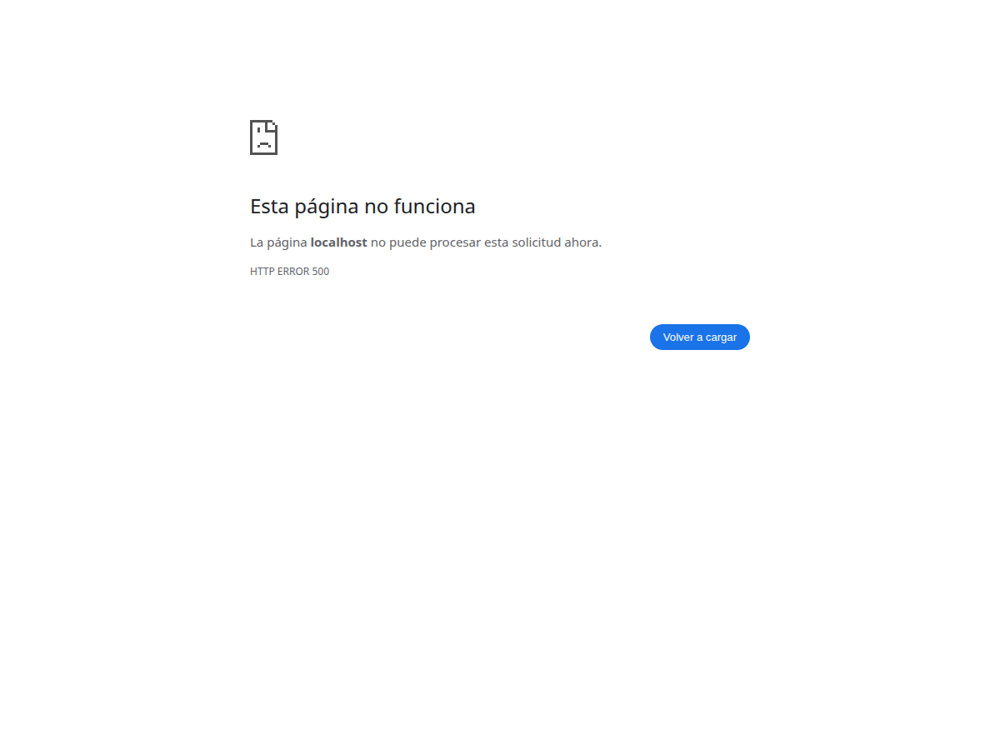

# alxarafe/resource-test



Este es un proyecto de demostración y pruebas (Showcase) para el ecosistema **Alxarafe Resource Controller**.

El propósito de este repositorio es ilustrar la potencia de la UI Declarativa de Alxarafe. Demuestra cómo, utilizando una arquitectura agnóstica sin Laravel ni Vue.js, se pueden construir formularios complejos y paneles anidados en muy pocas líneas de código.

## Características

- 🏗️ **UI Declarativa**: Toda la estructura de pestañas, paneles y campos se define en PHP puro mediante metadatos (Array/Objetos).
- ⚡ **HTML Puro**: Utiliza `alxarafe/resource-html` como adaptador de `RendererContract` para generar HTML sin motores de plantillas pesados.
- 💾 **Native PDO**: Integra `alxarafe/resource-pdo` para demostrar cómo un `RepositoryContract` puede funcionar con una base de datos SQLite en memoria, sin Eloquent.
- 🚀 **Cero Dependencias Framework**: Sin Laravel, sin Symfony, sin dependencias externas innecesarias.

## Ejecución Local

1. Clona el repositorio e instala dependencias:
   ```bash
   composer install
   ```

2. Arranca el servidor web integrado de PHP:
   ```bash
   php -S localhost:8000 -t public
   ```

3. Abre en tu navegador: http://localhost:8000

Verás la vista compleja generada dinámicamente a través de un único array de configuración devuelto por `DemoController`.

## Ecosistema Alxarafe

| Paquete | Propósito | Estado |
|---|---|---|
| **[resource-controller](https://github.com/alxarafe/resource-controller)** | Motor CRUD central + componentes UI | ✅ Estable |
| **[resource-eloquent](https://github.com/alxarafe/resource-eloquent)** | Adaptador ORM Eloquent | ✅ Estable |
| **[resource-pdo](https://github.com/alxarafe/resource-pdo)** | Adaptador nativo PDO | ✅ Estable |
| **[resource-blade](https://github.com/alxarafe/resource-blade)** | Adaptador de renderizado con Blade | ✅ Estable |
| **[resource-twig](https://github.com/alxarafe/resource-twig)** | Adaptador de renderizado con Twig | ✅ Estable |
| **[resource-html](https://github.com/alxarafe/resource-html)** | Adaptador de renderizado con plantillas PHP/HTML | ✅ Estable |
